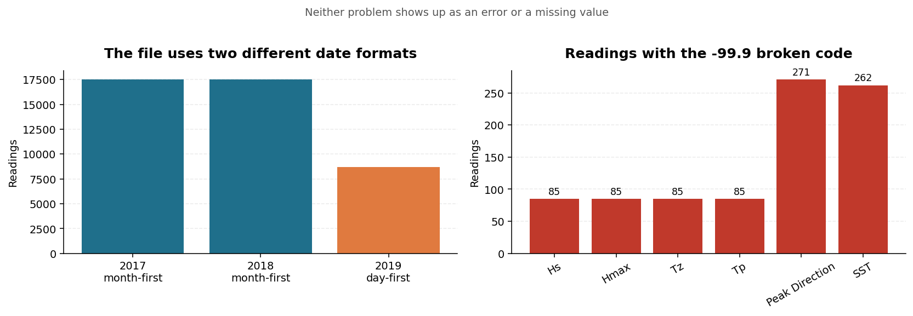
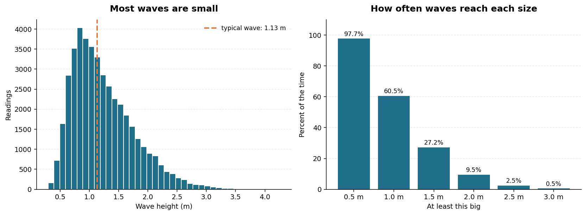
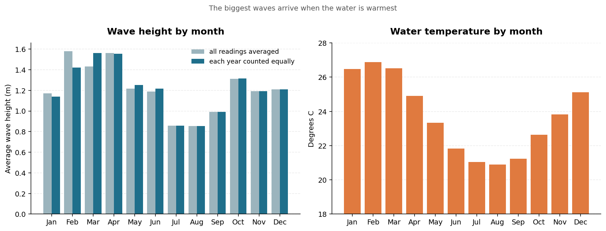
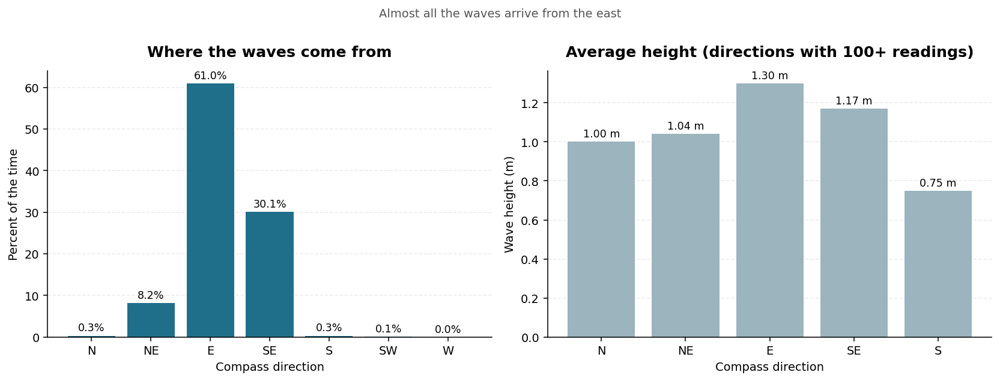

# Ocean Wave Analysis

I'm a surfer, so I wanted to work with real wave data.

This project looks at **43,728 measurements** from a floating buoy off the coast
of Mooloolaba, Australia. The buoy recorded the ocean every 30 minutes for two
and a half years, from January 2017 to June 2019.

I asked three questions:

1. **How big are the waves usually?**
2. **Which months have the biggest waves?**
3. **Which direction do the waves come from?**

Before I could answer any of them, I found **two problems in the data**. Neither
one showed an error message, and both would have quietly given me wrong answers.
Finding and fixing those turned out to be the most useful part of the project.

```bash
pip install -r requirements.txt
python run_analysis.py      # runs everything and prints all the numbers
python -m pytest tests/     # runs the 11 checks on my cleaning code
```

---

## The answers

| Question | Answer |
|---|---|
| How big are the waves? | Typically **1.13 m**. Over 1 m **60%** of the time, over 3 m only **0.5%** |
| Biggest month? | **March (1.56 m)**. Smallest is **August (0.85 m)** — about **1.8x** difference |
| Where from? | **The east.** 61% of the time, and 91% if you include the south-east |

---

## Problem 1: the dates were written two different ways



A date in the file looks like `01/02/2017`. Is that **January 2nd** or
**February 1st**? Different countries write it differently.

This one file used **both ways**. The 2017 and 2018 readings put the month first.
The 2019 readings put the day first.

Normally you'd let Python work the dates out automatically. When I did that, two
bad things happened, and **neither showed an error message**:

- **5,232 readings just vanished** — 12% of the data, silently gone
- **Many remaining dates had their day and month swapped**

I only noticed because the last date came out as **December 6th, 2019**, but the
file is only supposed to run to **June 2019**. December 6th is June 12th with the
numbers flipped.

### How I fixed it

One simple rule solves it: **a month is never bigger than 12, but a day can be.**

So if I see `31/01/2019`, the 31 must be the day. If I see `01/25/2017`, the 25
must be the day. I look at each year separately, work out which way round that
year is written, then read the dates properly.

If a batch of dates is genuinely impossible to tell apart, my code **stops with
an error** instead of guessing. Guessing is what caused the problem in the first
place.

### How I checked the fix worked

I didn't want to just look at the dates and hope. So I used something I knew had
to be true: **the buoy takes a reading every 30 minutes, without fail.**

If my dates were right, every reading should be exactly 30 minutes after the one
before. I checked all 43,727 gaps:

- Dates that failed to read: **0**
- Duplicated times: **0**
- Gaps that weren't exactly 30 minutes: **0**
- Date range: **1 Jan 2017 to 30 June 2019**, which matches the file name

That's proof the dates are right, not a guess.

---

## Problem 2: broken readings were disguised as real numbers

When I asked Python whether any data was missing, it said **nothing is missing**.
That was misleading.

When an instrument on the buoy breaks, it doesn't leave the space blank — it
writes **`-99.9`**. To a computer that looks like an ordinary number, so it gets
averaged in with the real readings.

It showed up worst in the water temperature:

| | Average | Coldest reading |
|---|---|---|
| Broken readings left in | 23.2 °C | **-99.9 °C** |
| Broken readings removed | **24.0 °C** | 19.8 °C |

Minus 99.9 degrees is obviously not a real ocean temperature. Only 274 readings
out of 43,728 were affected — less than 1% — but they were enough to shift the
numbers.

---

## Question 1: how big are the waves usually?



The typical wave is **1.13 m**. The smallest reading was 0.29 m and the biggest
was 4.26 m.

I used the **median** for "typical" rather than the average. The median is the
middle value, so half the readings are below it and half above. That's fairer
here, because a handful of very big days pull the average up and make the ocean
sound rougher than it usually is.

How often the waves reach each size:

| At least | Percent of the time |
|---|---|
| 0.5 m | 97.7% |
| 1.0 m | 60.5% |
| 1.5 m | 27.2% |
| 2.0 m | 9.5% |
| 2.5 m | 2.5% |
| 3.0 m | 0.5% |

So it's almost never completely flat, it's over a metre about **6 days out of
10**, and really big surf is rare — over 3 m happens **half a percent** of the
time.

---

## Question 2: which months have the biggest waves?



- **Biggest: March**, averaging **1.56 m**
- **Smallest: August**, averaging **0.85 m**

March waves are about **1.8 times bigger** than August waves. February through
April is the rough season, which lines up with cyclone season in that part of
Australia.

There's a nice bonus in the water temperature. The biggest waves arrive in
**February to April, when the water is warmest** (around 26–27 °C). The calmest
months, July and August, are also the coldest (around 21 °C). So the best surf
happens when you need the least wetsuit.

**One thing I had to be careful about.** The data starts in January 2017 but stops
in June 2019. That means January–June appear **three times** in the data while
July–December only appear **twice**. Just averaging everything would give the
first half of the year more weight.

So I worked it out two ways: once averaging all the readings together, and once
giving each year equal weight. Both gave the same answer, which tells me the
pattern is real and not just a side effect of when the buoy was recording.

---

## Question 3: which direction do the waves come from?



The buoy records which direction each wave arrives from, in degrees. I grouped
those into the eight compass directions and counted.

| Direction | Percent of the time | Average height |
|---|---|---|
| **East** | **61.0%** | 1.30 m |
| South-east | 30.1% | 1.17 m |
| North-east | 8.2% | 1.04 m |
| Everything else | 0.7% | — |

Waves come from the **east over 90% of the time** once you include the
south-east. That makes sense — Mooloolaba faces east into the Coral Sea, and the
land blocks everything from the west.

The east isn't just the most common direction, it also brings the **biggest**
waves (1.30 m on average, against 1.04 m from the north-east).

One small thing worth noting: a few directions only had a handful of readings —
west had **3**. An average of 3 readings doesn't mean anything, so the
average-height chart only shows directions with at least 100 readings behind
them.

---

## What's in this project

```
README.md              this file
run_analysis.py        run this to do everything
src/                   the code
  config.py            settings and constants
  load_data.py         opens the file
  clean_data.py        fixes the dates, removes broken readings
  analysis.py          answers the three questions
  plots.py             makes the charts
tests/                 11 automatic checks on the cleaning code
notebooks/             step-by-step walkthrough
figures/               the charts
data/                  the original data file
```

A few things I did on purpose:

**Opening the file and cleaning it are separate**, so I can always compare against
the untouched original and see exactly what my cleaning changed.

**Working out numbers and drawing charts are separate.** The code in `analysis.py`
never draws anything, and `plots.py` never works anything out. That's why the
numbers in this README can't disagree with the charts.

**The tests are on the cleaning code specifically.** A mistake in cleaning gives
you numbers that look perfectly normal but are wrong — which is exactly what both
problems above did. A wrong chart is obvious. Badly cleaned data isn't.

---

## What this project can't tell you

- **One buoy, one beach.** Mooloolaba faces east and is partly sheltered, so
  these results wouldn't hold everywhere along the coast.
- **Only two and a half years.** Enough to see a yearly pattern, nowhere near
  enough to say anything about long-term change.
- **No wind or storm information**, which is what actually causes big waves. This
  data can show *when* waves are big, but not *why*.
- **I don't know why the dates change format in 2019.** I found it and corrected
  it, but I can't tell you whether it came from the buoy, an export, or a
  spreadsheet somewhere along the way. That would be my first question if I could
  ask whoever collected it.

## Where the data came from

Coastal Data System – Waves (Mooloolaba), Queensland Government, via Kaggle.
The file in `data/` is the untouched original.
